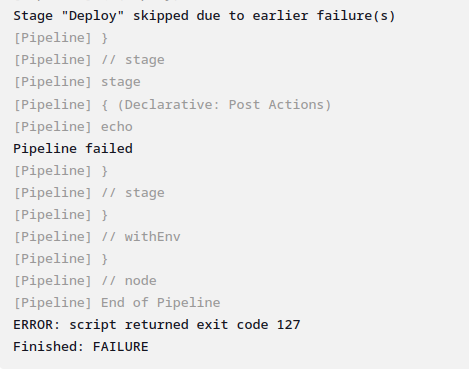

# Assignment 2 - Jenkins (Creating a DevOps pipeline, CI/CD tool)
#### Name: Mukund Deepak
#### SRN: PES2UG20CS206

## Task 1:
### Screenshot of the running Docker Container after installing Jenkins

## Task 2:

### Picture showing the console output after the build is successful

## Picture showing the Stable state of the task in Build History of Jenkins

## Task 3:

### Console output of second job

### Status page of first job

### Build History of Jenkins

### Jenkins Dashboard

## Task 4:

### Webhook added to your GitHub repository:

### Console Output of second job displaying the change made in hello.cpp file.

## Task 5:

### Code/script written to create basic pipeline using GitHub repository

### Output of working created pipeline, the screenshot should include:
  ● Stage view / Execution status of pipeline with all stages succeeded    
  ● Verify Declarative: Post Actions stage succeed for handling failures.

### Console Output of the Pipeline
**Correct Execution of Pipeline:**

**Erroneous Execution of Pipeline:**

### Link to Github Repo
[Github Repo](https://github.com/mukunddeepak/PES2UG20CS206_Jenkins/)

